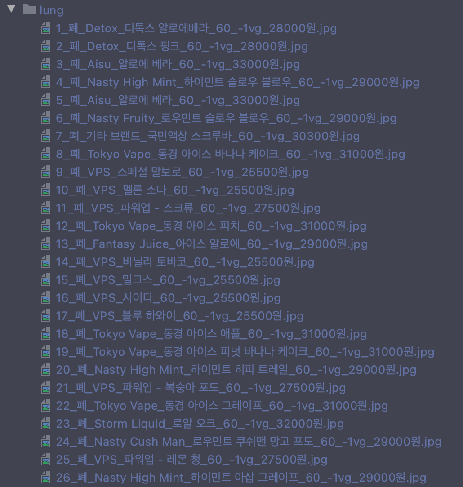

# scrapper

> scrape site

- crawler with [scrapy](https://docs.scrapy.org/en/latest/index.html)
- remove background images [rembg](https://github.com/danielgatis/rembg)

## setup

```bash
$ scrapy startproject poster
```

## run scrapper

```bash
$ scrapy crawl juice_mouth
```

- `dk factory`

```
# pwd: ./smoke
$ scrapy crawl dk_mouth -o dk_mouth.json
$ scrapy crawl dk_lung -o dk_lung.json
```




### okky scrapper

#### init

1. okky 페이지를 방문한다.
2. for i in range(10, 0, -1)
   1. 페이지의 24개 post를 각각 스크랩한다.
   2. reversed 해서 csv loader에 담는다.
      1. 각 페이지의 순서 보장할 것

#### update

> cronjob

1. okky 페이지를 방문한다.
2. csv loader의 가장 하당을 읽어 id값을 가져온다.
3. for i in range(1, max_try)
   1. for until_idx in range(24, 0, -1) // reversed order
      1. if post.id == latest_post_id: break
   2. for post in range(until_idx, 0, -1)
      1. insert to csv

### csv loader

- `insert`
- `set_posted`
- `bulk_insert`
- `read(window_size)`

### evape poster

1. evape site를 user의 수 만큼 연다.
2. 각 evape window에 로그인 한다.
3. with mutex lock (csv)
   1. 가장 아래 row를 pop한다.
4. pop된 데이터를 dataclass dto로 변환한다.
5. 이를 크롤러를 통해 작성한다.

추가로 나중에 parallel하게 진행하고 싶다면, 아래 기준으로 mod 연산을 쓰도록 한다.

> 2<= len(user) <= 11인 상황이라 가정하여 mod연산을 통해 post 선별
