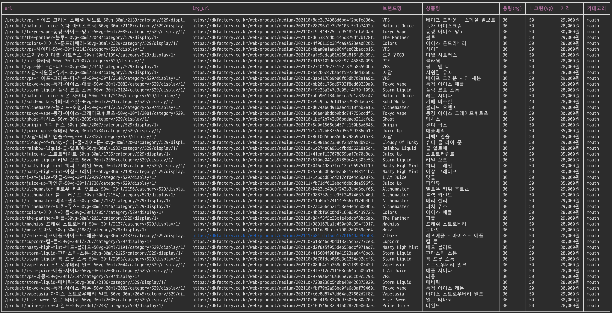

# scrapper
> scrape site

- crawler with [scrapy](https://docs.scrapy.org/en/latest/index.html)
- remove background images [rembg](https://github.com/danielgatis/rembg)


## run scrapper

```bash
# cd 상태에서 명령어 실행방법
$ scrapy crawl juice_mouth
$ scrapy crawl dk_mouth
$ scrapy crawl quotes -O quotes.json
```

